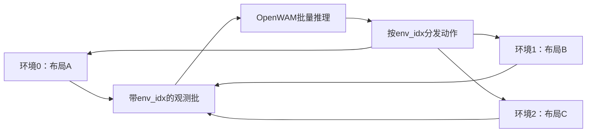

> 公开归档版，记录截至2026-09-28；主机地址、账号和绝对私有路径已脱敏。历史过程不代表当前下一步，复用先看 [RUNBOOK.md](RUNBOOK.md)。

# RoboDojo 榜单协议与并行环境：通俗解释

核查日期：2026-09-28。官方两页分别是 [Leaderboard Protocol](https://robodojo-benchmark.com/leaderboard/protocol) 和 [Parallel Environments](https://robodojo-benchmark.com/doc/sim-tasks/parallel-environments/)。前者讲“什么结果能获得官方验证并上榜”，后者讲“同一台模拟器怎样同时做更多试次”。

本文区分网页说明、当前代码、作者论文测量和工程推断；没有运行仿真。RoboDojo 源码基准为 `726e9aabfaa642203722eb126f5eaf0f37f3e1ad`。

## 1. Protocol 到底在规定什么

**你可以先私下测、保留代码和权重；若要成为官方 verified 榜单条目，就必须接受统一评测和可复现审查。** 当前协议页面显示日期为 2026.9.23。

可以把流程理解成：公开布局让大家能复现，官方服务统一计算成绩，隐藏布局检查是否只针对公开题目调过，公开精确模型与视频让社区复核。

| 条款 | 通俗意思 | 对我们当前目的的影响 |
|---|---|---|
| 官方执行 | 可交可部署策略包，或接入自己的远程策略服务器；官方系统算分。 | 本地跑通仍然有用，但本地自报数字不自动成为 verified 成绩。 |
| 重复与覆盖 | 仿真三种 seed 报均值/标准差；可以是三个训练seed模型，也可以一个模型配三个评测seed。真机覆盖 ARX X5、Piper、Piper X。 | 初期一个任务连通不是完整基准结果；也无需为初期目标提前全量跑。 |
| 隐藏验证 | 公开布局是主要评测，隐藏布局做一致性检查；显著异常可能排除。 | 不应围绕已知布局写专门硬编码。页面未公开统一的显著差异数值阈值。 |
| 公开材料 | verified 发布时交付精确权重、训练/部署代码、配置、复现步骤和评测视频。 | 私下开发期不等于立即开源；论文正式出结果时应保留可对应的版本。 |
| 新模型资格 | 方法创新或不同的数据/预训练方案至少满足一项，还需论文/技术报告或明确发布计划。 | 单纯复现既有 OpenWAM 是基础设施工作，不自动构成新模型上榜资格。 |
| 模型边界 | 当前不接受由高层 agent/orchestrator 调度多个明确不同策略或模型的提交。 | 单模型内部的多模块结构不能仅凭这句话判违规；具体边界由团队审核。 |

以上来自 [当前官方协议](https://robodojo-benchmark.com/leaderboard/protocol)。它还保留委员会技术审核和要求补材料的权限；没有承诺所有申请都被收录。

**申请怎么走：先向 XPolicyLab 发适配 PR，再通过官方申请表提交 PR、确切 commit、checkpoint 与运行配置。** [Submission 文档](https://robodojo-benchmark.com/doc/usage/robodojo-submission/)给的是操作流程，协议给的是 verified 发布条件；两者要一起看。

当前 XPolicyLab [CONTRIBUTING](https://github.com/XPolicyLab/XPolicyLab/blob/main/CONTRIBUTING.md)允许说明情况后先提交暂不开放训练代码的 eval-only adapter。这是适配/审查阶段的安排，不应据此推导 verified 发布条件已经取消。初期目标仍可先完成自己的数据、模型与一个任务闭环。

## 2. 并行环境是什么

想象在同一个 Isaac Sim 进程里摆了多张相隔一定距离的工作台，每张有自己的机器人、物体、相机和任务进度。一次获取多张桌子的观测，让策略批量预测，再把各自动作送回对应桌子。



官网文档把发布默认值写成下面这样（**与本轮实际源码不同步**）：

```yaml
scene:
  num_envs: 1
  env_spacing: 7
```

`num_envs` 是同时存在的环境数量；`env_spacing` 是场景实例在仿真世界中的间隔。官网另给5个环境的示例，并称发布默认1；但 2026-09-28 直接读取固定 SHA `726e9aab…` 与 `main` 的 `env_cfg/sim/sim_config.yml`，两者实际都为 **`num_envs: 10`**。因此1是网页的描述，10才是本次核到的源码值。启动前必须检查独立checkout最终配置，不能按网页假定只创建一个环境。[网页](https://robodojo-benchmark.com/doc/sim-tasks/parallel-environments/)、[固定版本配置](https://github.com/RoboDojo-Benchmark/RoboDojo/blob/726e9aabfaa642203722eb126f5eaf0f37f3e1ad/env_cfg/sim/sim_config.yml#L5)

实现上，IsaacLab 建立多个环境实例，RoboDojo 为每个实例加载seed控制的布局；图像和状态携带 `env_idx`，动作按该索引送回。不同环境可有不同物体、数量和布局，而非全部复制完全相同的桌面。论文称之为“异构并行”。当前公开命令入口 `--task_name` 仍选择一个任务类，不应把 `num_envs=10` 解读成这条命令自动选择10种不同任务。[BaseEnv](https://github.com/RoboDojo-Benchmark/RoboDojo/blob/726e9aabfaa642203722eb126f5eaf0f37f3e1ad/env/environment/base_env.py#L127)、[评测主入口](https://github.com/RoboDojo-Benchmark/RoboDojo/blob/726e9aabfaa642203722eb126f5eaf0f37f3e1ad/src/eval_client/main.py#L258)

## 3. 两层并行，以及两个容易忽略的限制

| 层次 | 做法 | 主要作用 |
|---|---|---|
| 进程内多环境 | 一个 Isaac Sim 进程的 `num_envs > 1`，观测与动作批处理。 | 同时评测多个episode，提高模拟器与策略利用率。 |
| 多GPU任务分组 | `--gpu-ids` 将任务按预置时间权重分给多个worker，每个worker运行自己的进程。 | 减少全任务评测总等待时间。 |

多GPU分组不会把所有显存合成一块，也不代表单个大模型自动分到多GPU；策略并行方式仍由该模型自己的实现决定。远程 `server/client` 又是模型侧与仿真侧的位置划分，可与上面两层组合。[Quick Evaluation](https://robodojo-benchmark.com/doc/usage/quick-evaluation/)

当前代码有两项明确限制：

1. `_random` 任务先应用 `sim.scene.clutter_env_limit`，缺省上限是5。请求10通常会先被限制成5；这只是默认保护，不是“5个必定稳定”。[pipeline_utils.py](https://github.com/RoboDojo-Benchmark/RoboDojo/blob/726e9aabfaa642203722eb126f5eaf0f37f3e1ad/utils/pipeline_utils.py#L57)
2. 若策略 `deploy.yml` 的 `eval_batch` 为 false，最终又会被强制成1，即便仿真配置写了更多。只有策略适配器支持批量观测/动作时，改大 `num_envs` 才有意义。[main.py](https://github.com/RoboDojo-Benchmark/RoboDojo/blob/726e9aabfaa642203722eb126f5eaf0f37f3e1ad/src/eval_client/main.py#L311)

**本轮已核当前官方 OpenWAM 适配有批处理路径**：`deploy.yml` 为 `eval_batch: true`，`deploy.py` 调用批量观测/动作接口，`model.py` 走 `engine.generate_batch`。这说明接口支持批处理；不证明任意批大小都能放进当前GPU或提高吞吐。[配置](https://github.com/XPolicyLab/XPolicyLab/blob/main/policy/OpenWAM/deploy.yml)、[部署循环](https://github.com/XPolicyLab/XPolicyLab/blob/main/policy/OpenWAM/deploy.py)、[模型适配](https://github.com/XPolicyLab/XPolicyLab/blob/main/policy/OpenWAM/model.py)

## 4. GPU显存、CPU内存会怎样增加

**并发主要换取吞吐，不是免费加速。** 环境越多，需要保留的状态、物体和相机越多；批量策略推理也可能需要更多中间张量。实际瓶颈可能在显存、主机内存、相机渲染、策略推理、网络传输或场景重置中的任意一项。

| 资源 | 随并发增加的主要部分 | 为什么不能只按环境数线性估算 |
|---|---|---|
| 仿真侧显存 | 渲染目标、相机缓冲、物理状态和资产。 | 材质/资产缓存与进程固定开销可能共享，具体场景几何与相机分辨率不同。 |
| 主机RAM | 场景对象导入、USD/物体元数据、观测搬运与编码。 | 随机杂物任务物体更多，reset、缓存及资源生命周期也影响峰值。 |
| 策略侧显存 | batch的图像/视频条件、激活、动作预测张量。 | 模型参数可共用，但推理中间量与缓存依实现变化；不能直接乘模型大小。 |
| 总耗时 | 物理推进、渲染、推理、通信、reset、写视频。 | 某部分饱和后，再加环境可能只增加排队或不稳定。 |

前两行的方向由 [Evaluation Issues](https://robodojo-benchmark.com/doc/common-issue/evaluation/)直接说明；共享开销、推理张量和瓶颈分析为工程解释，不是本机测量。当前评测代码已把视频逐帧写入文件，未再把完整episode的RGB帧都留在RAM；这不代表所有原生内存/渲染资源都不存在增长风险。[视频写入实现](https://github.com/RoboDojo-Benchmark/RoboDojo/blob/726e9aabfaa642203722eb126f5eaf0f37f3e1ad/src/eval_client/eval_env.py#L872)

并行文档没有给出“每环境占几GB”、`N=1/2/4/8` 的RAM/VRAM曲线，也没有 OpenWAM+H100 的吞吐表。本轮没有测量，不能据默认值倒推这些数字。

## 5. 官方到底有没有性能实测

**有吞吐实测，在论文，不在该并行教程页；没有查到对应的RAM/VRAM扩展曲线。**

论文§6.3.1/Table 4 的硬件为 **8×RTX 4090**：每卡一个 RoboDojo 进程、每进程10环境；需要模型时，π0.5在同一局域网的 **A800服务器**运行。

| 作者实验条件 | 平均吞吐（整组实验） |
|---|---:|
| RoboDojo异构并行，zero-action | 77.4 interactions/s |
| RoboDojo非异构并行，zero-action | 40.0 interactions/s |
| RoboDojo异构并行 + π0.5 | 64.0 interactions/s |
| RoboDojo非异构并行 + π0.5 | 39.2 interactions/s |

同组1,640,000帧，前两项分别5小时53分与11小时22分；含模型的两项分别7小时07分与11小时38分。**这是作者在其版本与8卡设置上的整体统计，不是每卡、每环境或OpenWAM速度，更不能换算成我们的H100结论。** zero-action测量省去策略推理，适合观察模拟器部分。[官方论文§6.3.1/Table 4](https://arxiv.org/html/2607.04434v1#S6.SS3.SSS1)

论文使用10环境；本次固定源码的仿真配置也是10，而官网仍称发布默认1。另有random缺省上限5和非batch策略强制1的运行时限制。这些来源与约束必须分别记录；比较结果还需锁定版本、场景、模型、batch、相机和硬件。首次单环境运行需要明确落实为1，`--eval-num 1`只限制试次数量，不能替代检查场景实例数。

## 6. 对初期 OpenWAM + RoboDojo 的直接用法

先把选定任务的观测、动作、重置、结果文件含义弄清楚；单环境闭环稳定后，并行才用于缩短重复评测。后续若授权做容量测量，记录有效episode/秒、模型推理时间、仿真/渲染/reset时间、GPU显存峰值、进程RAM峰值、异常样本数与最终生效num_envs，才可决定增加并发是否有收益。

硬件兼容性必须把“官方支持范围”和“本地实际运行证据”分开。本页的4090论文设置不证明H100不能运行；本页也没有自行复测H100。现场已有记录应由硬件专题按原始日志、结果和视频核定，不用默认要求代替现场事实。

## 阅读与证据边界

- 75个文档页的逐页内容和用途见 [OFFICIAL_DOCS_MAP.md](OFFICIAL_DOCS_MAP.md)。
- protocol首个HTML是应用壳，正文从当前官网JS的`tn`协议数据对象读取；不是凭论文旧版推断。源URL、脚本SHA256与提取范围见 protocol-source.json（完整本地证据未随公开版发布）。
- 官方并行页、故障页和论文原文保存在E盘 `round3/docs-source`，本地C盘只保留导览和解释。
- 这里没有授权或执行安装、启动、扩大现有实验预算、修改共享服务或提交官方申请。
