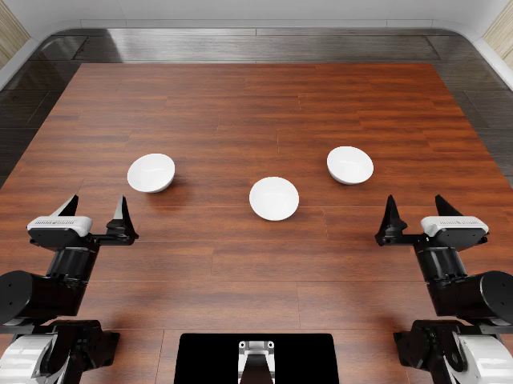
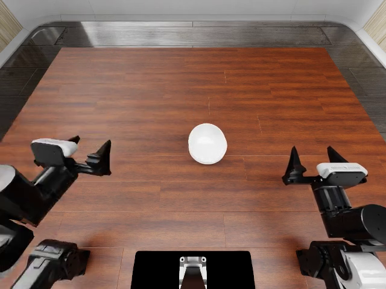

# OpenWAM + RoboDojo：第一次真实推理尝试

2026-09-28，H100 80GB、NVIDIA 595.71.05、Isaac Sim 5.1，官方 OpenWAM-Alpha-Sim-RoboDojo checkpoint：`stack_bowls / arx_x5 / ee / seed 0 / layout 0 / num_envs 1 / eval_num 1` 成功。19:44:08–19:50:45（UTC+8），397秒，退出码0，结果 `success=true`、汇总得分100。这是一个回合，不是全基准成功率。

| 要看什么 | 入口 |
|---|---|
| 最短复用方式、目录结构 | [RUNBOOK](RUNBOOK.md) |
| 做了什么、遇到什么、怎么修好 | [粗日志](RUN_LOG.md) |
| 逐步命令、输出、版本及失败记录 | [细日志](EXECUTION_LOG.md) · [原始命令与回执索引](evidence/STEPS.md) |
| 最终环境与运行配置 | [CURRENT_SETUP](CURRENT_SETUP.md) · [版本清单](versions.json) |
| H100 / 595 启动问题与兼容层 | [H100_COMPATIBILITY](H100_COMPATIBILITY.md) |
| 成功数值、三次完整运行日志和配置 | [结果 JSON](evidence/sz2_openwam_stack_bowls_s0_20260928_1944/result.json) · [evidence](evidence/) |
| 视频与抽帧 | [头部](media/stack_bowls_head.mp4) · [左腕](media/stack_bowls_left_wrist.mp4) · [右腕](media/stack_bowls_right_wrist.mp4) |
| 模型/仓库/官方文档/任务介绍 | [OpenWAM](OPENWAM_EXPLAINED.md) · [仓库导览](REPOSITORY_TOUR.md) · [逐页文档](OFFICIAL_DOCS_MAP.md) · [任务图册](TASK_ATLAS.md) |
| 后续 RLinf 接入资料 | [RPent/RLinf 调研](RLINF_RPENT_REUSE.md) |
| 公开范围与来源 | [PUBLICATION](PUBLICATION.md) |

初始头部画面：

成功回合末帧：

三路原生视频均为640×480、25 FPS、320帧、12.8秒。日志动作进度最终319/800；帧数不等于动作次数。原始结果由 RoboDojo 评分，未重写成功判据。
